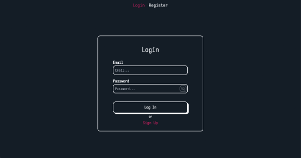
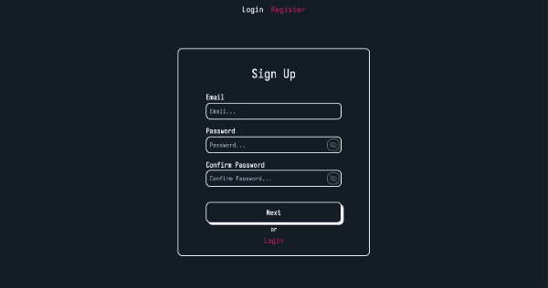
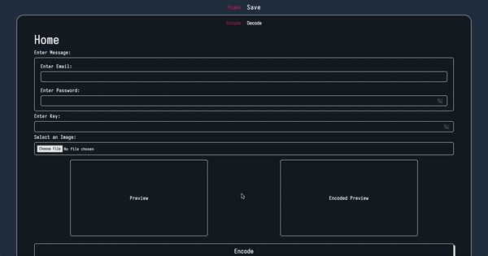
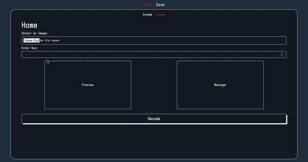
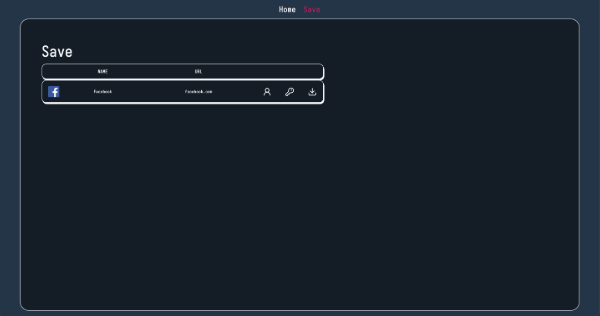

# HiddenVault

## Overview

The HiddenVault is a secure and password management app that encrypts passwords using AES encryption, and then embeds the encrypted passwords within an image. This unique approach leverages steganography to securely store sensitive data by hiding it inside images. The final encrypted image is stored in a Pocketbase database, while the frontend is built using SvelteKit for a responsive and user-friendly interface.

The app is designed to run with Docker Compose, ensuring a smooth deployment process and easy environment management.

## Features

- **AES Encryption**: All passwords are encrypted with a user-defined master password, ensuring data security.
- **Steganography**: Encrypted passwords are hidden inside images, making them more difficult to detect or extract.
- **Pocketbase Integration**: Stores the modified images securely in a lightweight, fast, and easy-to-use database.
- **SvelteKit Frontend**: A modern, fast, and responsive UI built with SvelteKit for managing passwords and interacting with the app.
- **Master Password**: The system relies on a master password for both encryption and decryption processes.

## Demo

1. **Authentication (Login and Register)**  
   The app includes secure authentication mechanisms for users to register and log in. Each user has a unique account, allowing them to access their encrypted passwords safely.

    - **Login Screen**  
        
      Users can log in using their email and master password, which serves as the key to decrypting their saved passwords.

    - **Register Screen**  
        
      New users can register by providing an email and setting up a master password. The master password is crucial for later decryption.

2. **Encode in Action**  
   After logging in, users can securely encode passwords within images. This step ensures that passwords are stored in a non-obvious, encrypted format.

    - **Encoding Screen**  
        
      Users upload an image and the app embeds encrypted password data within it. This gif shows how users interact with the interface to encode their passwords into images.

3. **Decode in Action**  
   Users can later retrieve their saved passwords by decoding the images. The master password is required to decrypt the data from the image.

    - **Decoding Screen**  
        
      This gif demonstrates how a user selects an encoded image, enters their master password, and retrieves the original password data.

4. **Password Manager**  
   The password manager allows users to view, save, and manage their stored passwords securely. All passwords are encrypted and can only be accessed with the master password.

    - **Save Screen**  
        
      This screen shows how users can save new passwords, assign names, and categorize them within the app, all while ensuring that the data remains encrypted.


## Setup Instructions

### Running with Docker Compose

1. **Clone the repository**:

   ```bash
   git clone https://github.com/zbrayan404/Password.git


2. **Navigate to the project directory:**:

    ```bash
    cd Password

3. **Docker Compose Setup**:
    Ensure you have Docker and Docker Compose installed on your machine. Then, run the following command to build and start the containers:

    ```bash
    docker-compose up --build -d

4. **Access Pocketbase Admin UI:**
    Once the Docker containers are running, you can access the Pocketbase Admin UI by navigating to:
    http://localhost:8080/_/

    Create a Pocketbase Admin Account:
    - When you first access the admin UI, you’ll be prompted to create an admin account.
    - Set up a username and password for the admin account. You will use these credentials to manage your Pocketbase instance and collections.
   
5. **Access the App**: 
    After the containers are up and running, access the app through your browser at http://localhost:3000.

6. **Stopping the App**: To stop the application, run:

    ```bash
    docker-compose down

7. **Start the App Again**: To rerun the application, run:

    ```bash
    docker-compose up -d